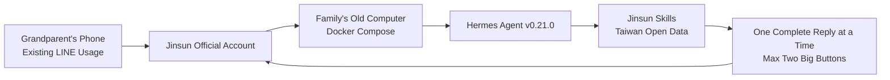

# Jinsun (金孫)

[繁體中文](README.md) · **English**

[](LICENSE)
[](https://github.com/nousresearch/hermes-agent)
[](docker-compose.yml)
[](https://developers.line.biz/en/docs/messaging-api/getting-started/)

Jinsun (金孫) is a LINE-based assistant for grandparents, running on your family's old computer. Developed by [Alternative Solutions Co., Ltd.](https://altsol.tw), it was first unveiled at the BUILDMODE GEN-AI HACKATHON 2026.

## Concept

In 48 hours, we aimed to create something truly usable, sustainable, and potentially world-changing. Not a sample that gets put away after the lights go off.

More importantly, we leveraged open-source projects to avoid reinventing the wheel and tailored the solution to fit the habits of Taiwanese users.

Jinsun is designed for grandparents. They already use LINE for chatting, sending voice messages, and sharing screenshots. However, they often get stuck when faced with forms, verifications, or new apps. Jinsun does not ask them to learn new tools; it simply adds a LINE friend. Jinsun resides on the family’s old computer, not as a cloud-based chatbot.

## What is Jinsun?

Jinsun is a home-use adaptation of [Hermes Agent](https://github.com/nousresearch/hermes-agent): an official Docker image with simplified settings, elder-friendly skills, Taiwanese open data, and LINE integration. It is not a new framework built from scratch.



1. **Image Recognition**: Identify where forms, bills, or registration slips are stuck.
2. **One Question at a Time**: Only two big buttons on the screen.
3. **Activity Registration**: Add community events to a homemade schedule.
4. **Family Reminders**: Medication schedules, appointments, deadlines, and event preparations.
5. **Fraud Prevention**: Block transfers, verification codes, unknown downloads, and remote desktop requests.
6. **Form Filling**: Help fill out public forms like community events or Google Forms.
7. **Daily Queries**: Weather, air quality, holidays, garbage truck schedules, power outages, public transport, nearby clinics, and long-term care centers.
8. **Local Events**: Regularly check community events near Taipei Expo Dome (花博爭艷館) and Zhongshan District.

## What Jinsun Won’t Do

1. **No Other Chat Apps**: Only LINE is supported.
2. **No Terminal Access**: No arbitrary commands or full desktop control.
3. **No Financial Transactions**: No payments, verification codes, or backend integrations with health or banking systems.
4. **No Medical Decisions**: No appointment scheduling, long-term care approvals, or medication changes.
5. **No External Data**: Data is confined to the `data` directory in this repository.

## Why Adapt, Not Rewrite?

Open-source agents already handle image recognition, voice-to-text, skills, scheduling, browser integration, and model login. What Taiwanese elders need is not another chatbot but:

1. **LINE Integration**: Not a new app.
2. **Simplicity**: One reply at a time, two big buttons.
3. **Fraud Prevention**: Block transfers and verification codes before they reach the model.
4. **Local Data**: Weather, buses, and community events tied to official Taiwanese data.
5. **Home-Based**: Runs on the family’s old computer, continuously.

Thus, Jinsun focuses on simplification and integration, not reinvention.

| What’s Used | What Jinsun Adds |
| --- | --- |
| Hermes Agent Official Docker Image | Only LINE, other chat channels disabled |
| Hermes Skills, Image Recognition, Voice, Scheduling | 17 elder-friendly skills and Taiwanese data tools |
| LINE Messaging API | Two big buttons, one reply at a time, no paid push notifications |
| Central Weather Administration, TDX, Ministry of Environment, district-office public lists | Plain-language replies; if there is no API key yet, it says so |
| Home Docker and HTTPS Tunnel | Independent data directory, no mixing with other Hermes installations |

## Recommended Hardware Specifications

Jinsun runs on a computer, not on the grandparent's phone. The phone is only for LINE.

**Minimum (Installable, Always On)**

1. Any desktop or laptop with [Docker](https://docs.docker.com/get-docker/) and Docker Compose installed. Windows 10 or Linux.
2. 8GB RAM recommended. 4GB works but avoid opening multiple browsers simultaneously.
3. Stable wired or wireless internet. Disable sleep and hibernation, keep power plugged in.
4. One public HTTPS URL (home static IP or Cloudflare tunnel) for LINE webhook and image transmission.
5. One-click Docker startup. Data directory is `data` in this repository, independent of other Hermes installations.

**Recommended**

1. Dedicated mini PC or retired home computer, not used for daily browsing.
2. Can be connected to a TV or run headless, interacting solely via LINE.
3. Estimate electricity costs based on "always-on small PC," not precise kWh.

**Grandparent Side**

1. Own smartphone, already uses LINE.
2. Add Jinsun as a friend. Increase font size. No new apps needed.

## Hermes Agent Version

This public code uses the following version. For home reinstalls, refer to `hermes --version` inside the container.

| Item | Version Used |
| --- | --- |
| Project | [Hermes Agent](https://github.com/nousresearch/hermes-agent) (Nous Research) |
| License | MIT, see [LICENSE.hermes-agent](LICENSE.hermes-agent) |
| Version | v0.21.0 (dated 2026-08-31) |
| Upstream Commit | [`63279301`](https://github.com/nousresearch/hermes-agent/commit/63279301bcbdc185c1b07b98a9312eb0c862f26d) |
| Docker Image | `nousresearch/hermes-agent:latest` |
| Image Digest | `sha256:76d5d17a201bb623268c02d43e397925e8f0127eb29b2e00fc48632d74945b05` |
| Installation | Official Docker image. Jinsun uses mounts for customization, not modifying the image itself |

Jinsun's modifications are in `overlay/`: speech style, settings, skills, LINE one-reply-at-a-time, fraud prevention, Taiwanese data tools. When upstream updates, check `overlay/line/adapter.py` before switching images.

## Skills Used

Skills are in `overlay/skills/`. Only these are loaded at startup; development skills are disabled.

**How to Ask, How to Recognize**

| Skill | What Grandparents Encounter |
| --- | --- |
| `jinsun-two-buttons` | One question at a time, two big buttons |
| `jinsun-recognize-screenshot` | Send screenshots of forms, bills, registration slips |

**How to Write**

| Skill | What Grandparents Encounter |
| --- | --- |
| `jinsun-register-activity` | Add community events to homemade schedule |
| `jinsun-family-reminder` | Medication, appointments, deadlines, event preparations |
| `jinsun-fill-webpage` | Help fill public forms on the home computer |

**How to Block**

| Skill | What Grandparents Encounter |
| --- | --- |
| `jinsun-block-scam` | Block transfers, verification codes, unknown downloads, remote desktop, prize scams |

**Taiwanese Daily Life**

| Skill | What Grandparents Encounter |
| --- | --- |
| `jinsun-weather` | Rain, temperature, typhoons, earthquakes |
| `jinsun-air-quality` | Air quality, whether it’s safe to go out |
| `jinsun-disaster-alert` | Alerts, water outages, heavy rain |
| `jinsun-holiday` | Holidays, post office hours |
| `jinsun-garbage-truck` | Garbage truck schedule, collection days |
| `jinsun-power-outage` | Planned power outages |
| `jinsun-transit` | Next bus, MRT, train |
| `jinsun-nearby-clinic` | Nearby clinics, pharmacies |
| `jinsun-long-term-care` | Nearby long-term care centers, reminder to call 1966 |
| `jinsun-medicine-lookup` | Medicine names on prescriptions; follow the pharmacist's instructions |
| `jinsun-weekly-local` | Weekly community events near Taipei Expo Dome (花博爭艷館) and Zhongshan District |

## Installation

At the project root:

```bash
./scripts/bootstrap_data.sh
docker compose up -d
./scripts/smoke_inside_container.sh
./scripts/seed_cron.sh
```

Data is mounted at `./data`. Network is standard bridge, not host network. LINE webhook is bound to `127.0.0.1:18646`.

You can test skills and scheduling without a LINE account. Installation checks will log a homemade registration, block a transfer, and read four reminder scripts.

Copy `overlay/env.example` to `.env` at the repository root. Do not commit `.env` to git.

## Models: GPT or Grok

Jinsun is for grandparents. Use front-line models with subscription browser or device code login, not API keys:

1. Grok (SuperGrok / xAI device code). Default.
2. ChatGPT or Codex subscription (OpenAI device code).

Do not downgrade to cheaper models to save costs. Do not use Gemini. Do not paste API keys into `.env`.

After the container starts, log in on the home computer.

Grok:

```bash
docker exec -it -u 1000 -e HOME=/opt/data -e HERMES_HOME=/opt/data jinsun \
  /opt/hermes/.venv/bin/hermes auth add xai-oauth --type oauth --no-browser
```

ChatGPT or Codex:

```bash
./scripts/auth_codex.sh
```

A device code URL will appear. Open it in a browser with the corresponding subscription account, enter the code, and approve. Login status is written to `./data/auth.json`, do not commit to git.

## Apply for a LINE Official Account

Jinsun does not include a channel secret. Family members must apply for one. Starting September 4, 2024, LINE Developers Console no longer allows direct Messaging API channel creation; you must first have a LINE Official Account. Follow the [LINE Developers Documentation](https://developers.line.biz/en/docs/messaging-api/getting-started/).

1. Register at [Business ID](https://account.line.biz/signup?redirectUri=https://entry.line.biz/form/entry/unverified) with a LINE account or email.
2. Fill out the [Official Account Application Form](https://entry.line.biz/form/entry/unverified). Display name can be "Jinsun." Confirm account creation at [LINE Official Account Manager](https://manager.line.biz/).
3. Enable Messaging API for this account in Official Account Manager. The system will create a corresponding Messaging API channel. Choose provider carefully; it cannot be changed later.
4. Log in to [LINE Developers Console](https://developers.line.biz/console/) with the same account. Open the channel.
5. Copy **Channel secret** from Basic settings.
6. Issue **Channel access token** in the Messaging API tab. Use long-term tokens for home use; for long-term operation, consider using expiring Channel access token v2.1.
7. Fill in **Webhook URL**: `https://your-public-url/line/webhook`. Must be public HTTPS, not self-signed. Verify and enable **Use webhook**.
8. Disable welcome messages and auto-replies in the Official Account settings to avoid duplicate messages. Can be done in Developers Console or Official Account Manager.
9. Use the QR code to add Jinsun to the grandparent's LINE.
10. Have the grandparent send a message. Retrieve the user ID (`U` prefix) from logs or Developers Console and add it to `.env` under `LINE_ALLOWED_USERS` and `LINE_HOME_CHANNEL`. Jinsun ignores users not in the allowlist.

Also fill in `.env`:

1. `LINE_CHANNEL_ACCESS_TOKEN`
2. `LINE_CHANNEL_SECRET`
3. `LINE_PUBLIC_URL` (public HTTPS root URL for image transmission)

After filling:

```bash
docker compose up -d
```

This includes a Cloudflare named tunnel container named `jinsun-tunnel`. Token is only in local `.env` under `JINSUN_TUNNEL_TOKEN`, do not commit. You can use your own reverse proxy as long as it points HTTPS to localhost:18646.

### LINE Free Quota

Reply tokens do not count toward monthly quotas. Push notifications do. Jinsun defaults to disabling streaming, mid-stream replies, and push fallbacks, sending one complete reply per interaction. If the model takes over 40 seconds, it leaves a free 「看回覆」 button, sending the full reply when clicked. Do not enable `LINE_ALLOW_PUSH` unless you are willing to use push quotas. Enable `LINE_CRON_ALLOW_PUSH` only if weekly local summaries need to be pushed to LINE.

Current formats sent to grandparents: plain text, two big buttons, 「看回覆」 when the model is still thinking, and images/voice/videos if public HTTPS is available. No Flex cards, carousels, or graphical menus.

## Taiwan Open Data (Optional)

Can run without these, but will reply with "No license yet" for relevant queries. Apply for licenses yourself; do not copy someone else's keys.

1. Central Weather Administration open data key: <https://opendata.cwa.gov.tw/user/authkey>
2. Ministry of Environment open data platform (air quality)
3. Ministry of Transportation TDX (Public Transport Real-Time)

## Security

1. `.env`, `data/auth.json`, Google login files, tunnel tokens must not be committed to git. See [SECURITY.md](SECURITY.md).
2. Incoming messages are scanned for transfers, verification codes, unknown downloads, remote desktop, and prize scams. Blocked if detected, no steps taught.
3. Browser form filling only handles community events, senior activities, and public Google Forms. Banks, health insurance, household registration, and payments are immediately stopped.
4. Default replies only to allowlisted users. Do not enable `LINE_ALLOW_ALL_USERS` for production.
5. Do not use Jinsun to modify system or account passwords. Do not include keys in conversations, web pages, or public repositories.

## Directory Structure

```
overlay/SOUL.md          How Jinsun Speaks
overlay/config.yaml      Other Channels and Dangerous Tools Removed
overlay/skills/          17 Elder-Friendly Skills
overlay/mcp/             Homemade Registration, Reminders, Blocks, Taiwanese Data
overlay/line/            LINE One Reply at a Time, Two Big Buttons
overlay/hooks/           Incoming Fraud Prevention
overlay/scripts/         Scheduling and Home Scripts
scripts/                 Installation, Login, Installation Checks
data/                    Runtime Data (Not Committed to Git)
tests/                   Boundary Tests Without Docker
```

## License

- Jinsun Adaptation: MIT ([LICENSE](LICENSE)), Copyright 2026 Alternative Solutions Co., Ltd.
- Hermes Agent (Nous Research): MIT ([LICENSE.hermes-agent](LICENSE.hermes-agent))
- Permitted for use, modification, and public distribution. Third-party and existing programs see [NOTICE.md](NOTICE.md).

## Acknowledgments

- [Nous Research](https://github.com/nousresearch/hermes-agent) for Hermes Agent
- LINE Messaging API
- Central Weather Administration, Ministry of Transportation TDX, Ministry of Environment, and Taipei Zhongshan District public lists
- BUILDMODE GEN-AI HACKATHON 2026