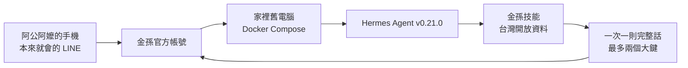

# 金孫

**繁體中文** · [English](README.en.md)

[](LICENSE)
[](https://github.com/nousresearch/hermes-agent)
[](docker-compose.yml)
[](https://developers.line.biz/zh-hant/docs/messaging-api/getting-started/)

阿公阿嬤用自己的手機，在本來就會的 LINE 裡傳截圖和語音。金孫住在家裡那台舊電腦上。

由[替代方案有限公司](https://altsol.tw)（Alternative Solutions Co., Ltd.）開發。最初在 BUILDMODE GEN-AI HACKATHON 2026 公開。

## 理念

48 小時，要做出真的能用、能一直用下去、而且能改變世界的產品。不是展示完就收起來的樣品。

更重要的是：好好用開源專案已經做成的力量，不要再重複造輪子，並且符合台灣使用者的習慣。

金孫服務的是家裡的阿公阿嬤。長輩不是不會用手機。他們會在 LINE 聊天、傳語音、傳截圖。一碰到要填表、要驗證、要換新應用程式，就卡死。所以金孫不叫他們學新工具，只加一個 LINE 好友。金孫本人住在家裡那台舊電腦，不是租在雲端的聊天框。

## 這是什麼

金孫是 [Hermes Agent](https://github.com/nousresearch/hermes-agent) 的家用改裝：官方 Docker 映像，加上減法設定、長輩技能、台灣開放資料與 LINE 通道。不是從零寫一個新框架。



1. 認圖：報名表、帳單、掛號單卡在哪一格。
2. 一次只問一件事。螢幕上最多兩個大鍵。
3. 寫入家裡的自製活動表，回編號。這不是公所或醫院的正式系統。
4. 寫入家庭提醒：吃藥、看診前一天、繳費截止、活動前一天要帶什麼。
5. 轉帳、驗證碼、陌生下載、遠端桌面預設擋住，請家人看。
6. 在家裡這台電腦開瀏覽器，幫填里民活動或任何人都能填的 Google 表單。
7. 查天氣、空氣、放假、垃圾車、停電、公車捷運台鐵、附近診所藥局、長照據點。
8. 可定期查證台北市中山區、花博爭艷館附近的里民活動。沒寫在公所表上的不講。

## 這份不會做什麼

1. 不開 Telegram、Discord、Slack 或其它聊天軟體。這份只服務 LINE。
2. 不給長輩終端機，不執行任意指令，不代操作整台桌面。
3. 不代扣款、不代收驗證碼、不接健保或銀行真後端。
4. 不掛號、不核准長照、不叫人停藥。
5. 不把其它人的工作目錄掛進來。資料只在這個倉庫的 `data`。

## 為什麼是拼裝，不是重寫

開源代理已經把認圖、語音轉文字、技能、排程、瀏覽器與模型登入做好了。台灣長輩缺的不是再一個聊天模型，而是：

1. 通道要是 LINE，不是新應用程式。
2. 一次一則、兩個大鍵，不要選單牆。
3. 轉帳與驗證碼要在進模型前擋住。
4. 天氣、公車、里民活動要接台灣官方資料，不要編造。
5. 裝在家裡舊電腦，裝好之後還能一直跑。

所以金孫做減法與接線，不重造輪子。

| 用了什麼 | 金孫加了什麼 |
| --- | --- |
| Hermes Agent 官方 Docker 映像 | 只開 LINE，關掉其它聊天通道 |
| Hermes 技能、認圖、語音、排程 | 17 個長輩技能與台灣資料工具 |
| LINE Messaging API | 兩個大鍵、一次一則、預設不走計費推播 |
| 中央氣象署、交通部 TDX、環境部、區公所公開表 | 白話回覆；沒申請授權就老實說查不了 |
| 家裡的 Docker 與 HTTPS 隧道 | 資料目錄獨立，不與其它 Hermes 混裝 |

## 家用舊電腦建議規格

金孫跑在電腦上，不是跑在長輩手機裡。手機只負責 LINE。

**最低（能裝起來、能常開）**

1. 任何還能開機的桌上型或筆電，已裝 [Docker](https://docs.docker.com/get-docker/) 與 Docker Compose。Windows 10 或以上，或 Linux。
2. 記憶體 8GB 以上較穩。4GB 能跑，但不要同時開一堆瀏覽器。
3. 有線或穩定無線網路。關閉睡眠與休眠，電源常插。
4. 外網 HTTPS 一條（家用固定網址，或 Cloudflare 隧道），LINE 的 Webhook 與傳圖才通。
5. 用 Docker 一鍵啟動。資料目錄就是這個倉庫的 `data`，獨立，不要跟其它 Hermes 混裝。

**建議**

1. 二手迷你主機或家裡退役電腦，專機專用，不要當日常上網機。
2. 接電視或完全不接螢幕都可以，平常靠 LINE 互動。
3. 電費用「常開小主機」來估，不要承諾精確度數。

**長輩側**

1. 自己的智慧型手機，已會用 LINE。
2. 把金孫加為好友。字級開大。不用新應用程式。

## 來自哪個 Hermes Agent

這份公開程式使用下面這一版。家裡以後重裝，以容器內 `hermes --version` 為準。

| 項目 | 這份使用的版本 |
| --- | --- |
| 專案 | [Hermes Agent](https://github.com/nousresearch/hermes-agent)（Nous Research） |
| 授權 | MIT，見 [LICENSE.hermes-agent](LICENSE.hermes-agent) |
| 版本 | v0.21.0（標示日期 2026-08-31） |
| 上游提交 | [`63279301`](https://github.com/nousresearch/hermes-agent/commit/63279301bcbdc185c1b07b98a9312eb0c862f26d) |
| Docker 映像 | `nousresearch/hermes-agent:latest` |
| 映像摘要 | `sha256:76d5d17a201bb623268c02d43e397925e8f0127eb29b2e00fc48632d74945b05` |
| 安裝方式 | 官方 Docker 映像。金孫用掛載做改裝，不改映像本體 |

金孫改了什麼，都在 `overlay/`：說話方式、設定、技能、LINE 一次一則、進線擋詐騙、台灣資料工具。上游更新時，先對過 `overlay/line/adapter.py` 再換映像。

## 使用到哪些技能

技能都在 `overlay/skills/`。啟動時只載入這些，開發用技能會關掉。

**怎麼問、怎麼認**

| 技能 | 長輩碰到什麼 |
| --- | --- |
| `jinsun-two-buttons` | 一次一題，螢幕上兩個大鍵 |
| `jinsun-recognize-screenshot` | 傳報名表、帳單、掛號單截圖 |

**怎麼寫進去**

| 技能 | 長輩碰到什麼 |
| --- | --- |
| `jinsun-register-activity` | 把里民活動寫進家裡自製表 |
| `jinsun-family-reminder` | 吃藥、看診、繳費、活動前一天 |
| `jinsun-fill-webpage` | 在家裡電腦幫填公開表單 |

**怎麼擋住**

| 技能 | 長輩碰到什麼 |
| --- | --- |
| `jinsun-block-scam` | 轉帳、驗證碼、陌生下載、遠端桌面、中獎要繳費 |

**台灣日常**

| 技能 | 長輩碰到什麼 |
| --- | --- |
| `jinsun-weather` | 下雨、氣溫、颱風、地震 |
| `jinsun-air-quality` | 空氣好不好、能不能出門散步 |
| `jinsun-disaster-alert` | 這區有沒有警報、停水、豪雨 |
| `jinsun-holiday` | 明天放不放假、郵局有沒有開 |
| `jinsun-garbage-truck` | 垃圾車幾點來、今天收不收 |
| `jinsun-power-outage` | 這區會不會計畫停電 |
| `jinsun-transit` | 下一班公車、捷運、台鐵 |
| `jinsun-nearby-clinic` | 附近診所、藥局 |
| `jinsun-long-term-care` | 附近長照據點，並提醒打 1966 |
| `jinsun-medicine-lookup` | 藥袋上的名字；怎麼吃以藥師為準 |
| `jinsun-weekly-local` | 這週花博爭艷館、中山區附近里民活動 |

## 安裝

在專案根目錄：

```bash
./scripts/bootstrap_data.sh
docker compose up -d
./scripts/smoke_inside_container.sh
./scripts/seed_cron.sh
```

資料只掛 `./data`。網路是普通橋接，不是 host 網路。LINE webhook 只綁本機 `127.0.0.1:18646`。

還沒申請 LINE 也能先測技能與排程。安裝檢查會寫一筆自製報名、擋住一筆轉帳、唸出四種提醒稿。

把 `overlay/env.example` 複製成倉庫根目錄的 `.env`。不要把填好的 `.env` 提交到 git。

## 模型：GPT 或 Grok

金孫是給阿公阿嬤用的。請用前線模型，用訂閱在瀏覽器或裝置碼登入，不要 API 金鑰：

1. Grok（SuperGrok／xAI 裝置碼）。這份預設走這條。
2. ChatGPT 或 Codex 訂閱（OpenAI 裝置碼）。

不要為了省一點成本改成較便宜的檔。不要使用 Gemini。不要把 API 金鑰貼進 `.env`。

容器起來後，在家裡那台電腦擇一登入。

Grok：

```bash
docker exec -it -u 1000 -e HOME=/opt/data -e HERMES_HOME=/opt/data jinsun \
  /opt/hermes/.venv/bin/hermes auth add xai-oauth --type oauth --no-browser
```

ChatGPT 或 Codex：

```bash
./scripts/auth_codex.sh
```

畫面上會出現裝置碼網址。用對應訂閱帳號在瀏覽器打開、輸入代碼、按允許。登入狀態寫在 `./data/auth.json`，不要提交到 git。

## 申請 LINE 官方帳號

金孫沒有附頻道密鑰。要由家人自己申請。官方從 2024-09-04 起，不能再從 LINE Developers Console 直接開 Messaging API 頻道，必須先有 LINE 官方帳號，再開 Messaging API。步驟以 [LINE Developers 文件](https://developers.line.biz/zh-hant/docs/messaging-api/getting-started/) 為準。

1. 用 LINE 帳號或電子郵件到 [Business ID](https://account.line.biz/signup?redirectUri=https://entry.line.biz/form/entry/unverified) 註冊。
2. 填 [官方帳號申請表](https://entry.line.biz/form/entry/unverified)。顯示名稱可寫「金孫」。完成後到 [LINE Official Account Manager](https://manager.line.biz/) 確認帳號已建立。
3. 在 Official Account Manager 為這個帳號開啟 Messaging API。系統會建立對應的 Messaging API 頻道。選 provider 時要小心：選定後不能改掛到別的 provider。
4. 用同一個帳號登入 [LINE Developers Console](https://developers.line.biz/console/)。打開該頻道。
5. 在 Basic settings 複製 **Channel secret**。
6. 在 Messaging API 分頁發行 **Channel access token**。家用先用長期權杖即可；若要長期運轉，建議改用有到期日的 Channel access token v2.1。
7. 同一頁填 **Webhook URL**：`https://你的公開網址/line/webhook`。必須是公開 HTTPS，不能是自己簽的憑證。按 Verify，成功後開啟 **Use webhook**。
8. 關掉官方帳號的加入好友歡迎訊息與自動回應，否則長輩會同時收到官方自動回與金孫的話。可在 Developers Console 的 Messaging API 分頁按 Edit，或到 Official Account Manager 的回應設定關閉。
9. 用該分頁的 QR code，把金孫加到長輩的 LINE。
10. 長輩傳一句話進來。從紀錄或 Developers Console 取出使用者編號（`U` 開頭），填進 `.env` 的 `LINE_ALLOWED_USERS` 與 `LINE_HOME_CHANNEL`。沒寫進允許名單的人，金孫不理。

`.env` 還要填：

1. `LINE_CHANNEL_ACCESS_TOKEN`
2. `LINE_CHANNEL_SECRET`
3. `LINE_PUBLIC_URL`（對外 HTTPS 根網址，傳圖才通）

填好後：

```bash
docker compose up -d
```

這份附一個 Cloudflare 具名隧道容器，名稱是 `jinsun-tunnel`。權杖只放本機 `.env` 的 `JINSUN_TUNNEL_TOKEN`，不要提交。你也可以用自己的反向代理，只要最後是 HTTPS 指到本機 18646。

### LINE 免費額度

用回覆權杖的 Reply 不計月額。Push 推播才計。金孫預設關掉串流、中途連發與推播後援，一次處理完只回一則。模型想超過約 40 秒時，會先留一個免費的「看回覆」鍵，點了再用免費回覆送完整那一則。不要把 `LINE_ALLOW_PUSH` 打開，除非你願意吃推播月額。每週在地摘要若要主動傳到 LINE，才開 `LINE_CRON_ALLOW_PUSH`。

金孫現在會發給長輩的格式：純文字、問答兩個大鍵、模型想太久時的「看回覆」、以及有公開 HTTPS 時的圖／語音／影片。沒有接 Flex 卡片、輪播、圖文選單。

## 台灣開放資料（可選）

沒填也能跑，只是該項會回白話說明「還沒申請授權」。自己去官方申請，不要抄別人的金鑰。

1. 中央氣象署開放資料授權碼：<https://opendata.cwa.gov.tw/user/authkey>
2. 環境部環境資料開放平臺（空氣品質）
3. 交通部 TDX（公車捷運台鐵即時）

## 安全

1. `.env`、`data/auth.json`、Google 登入檔、隧道權杖不准進 git。見 [SECURITY.md](SECURITY.md)。
2. 進線會先掃轉帳、驗證碼、陌生下載、遠端桌面、中獎要繳費。掃到就擋，不教步驟。
3. 瀏覽器代填只處理里民活動、樂齡、公開 Google 表單。銀行、健保、戶政、支付立刻停。
4. 預設只回允許名單裡的人。不要開 `LINE_ALLOW_ALL_USERS` 當正式。
5. 不要用金孫去改任何系統或帳號密碼。金鑰不要放進對話、網頁或公開倉庫。

## 目錄

```
overlay/SOUL.md          金孫怎麼說話
overlay/config.yaml      已拔掉其它通道與危險工具
overlay/skills/          17 個長輩技能
overlay/mcp/             自製報名表、提醒、擋住、台灣資料
overlay/line/            LINE 一次一則、兩個大鍵
overlay/hooks/           進線擋詐騙
overlay/scripts/         排程與家用腳本
scripts/                 安裝、登入、安裝檢查
data/                    執行期資料（不進 git）
tests/                   沒有 Docker 也能跑的邊界測試
```

## 授權

- 金孫這份改裝：MIT（[LICENSE](LICENSE)），著作權 2026 替代方案有限公司
- Hermes Agent（Nous Research）：MIT（[LICENSE.hermes-agent](LICENSE.hermes-agent)）
- 允許使用、修改、公開。第三方與既有程式見 [NOTICE.md](NOTICE.md)

## 致謝

- [Nous Research](https://github.com/nousresearch/hermes-agent) 的 Hermes Agent
- LINE Messaging API
- 中央氣象署、交通部 TDX、環境部、台北市中山區公所公開資料
- BUILDMODE GEN-AI HACKATHON 2026
